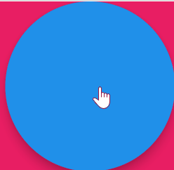

# Color BLoC Drill

[Video Tutorial](https://youtu.be/YF3ci16QpoQ)

For repetition

## Create new project for Bloc

1. New Project: create new project, add flutter_bloc, equatable
1. Flutter Color Container: delete all code below runApp, create new StatelessWidget with MaterialApp wrapped with Container with FloatingActionButton
1. template bloc files: create event, state, bloc files using extension in `lib/blocs/color/`
1. BlocProvider: wrap MaterialApp 
1. BlocBuilder: wrap Container 

## Configure  State, Event, Bloc files

1. state: delete code. create new ColorState class that extends Equatable.  Create final Color color. import material
    1. contructor - change to required
    1. equatable
    1. toString
    1. copyWith
    1. factory - ColorState.initial return pink
1. event: add ChangeColorEvent
1. bloc: 
    1. ColorState.initial()
    1. ChangeColorEvent - emit ColorState amber

## Show Bloc Information on UI

1. set color to container from Bloc state

## Change Bloc State from Button

1. add new state to Bloc stream from FloatingActionButton

## Modify Bloc to emit random color

1. organize callback function into separate method
2. emit random color
